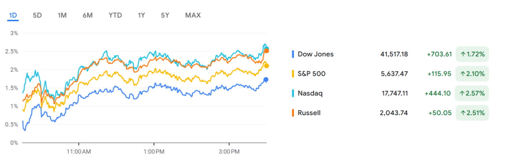
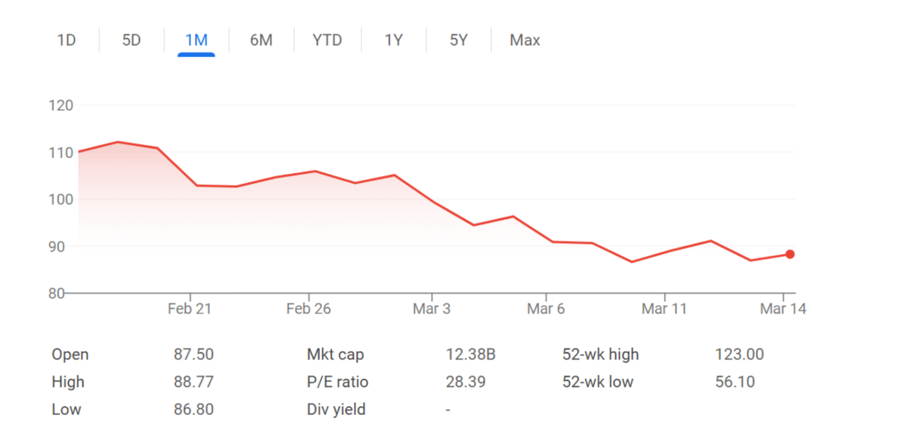

## Happy National Artichoke Hearts Day UCF! 

I hope this market watch finds you well. 

[Eggs Are So Expensive People Are Smuggling Them In From Mexico](https://www.wsj.com/articles/mexico-egg-smuggling-prices-940b3163?mod=latest_headlines)
- The cost of eggs in the U.S. has skyrocketed, averaging $5.90 per dozen, compared to $3 a year ago, due to an avian flu outbreak reducing supply.
- Consumers are illegally bringing in cheaper eggs from Mexico, where prices are under $2 per dozen, leading to a 36% rise in egg-related border interceptions.
- The Trump administration is investigating price manipulation and plans to invest $1 billion to stabilize supply, including $500 million for biosecurity measures.
- Customs and Border Protection (CBP) is seizing eggs and fining offenders, with penalties starting at $300 for first-time violation

The cost of eggs has skyrocketed, and as a result, consumers are attempting to illegally smuggle goods in from Mexico. This spike in egg prices directly contributes to food inflation which is affecting both consumers and businesses. Eggs are a staple ingredient in many processed foods, including baked goods, mayonnaise, and many dairy substitutes, and an increase in the cost of eggs is going to result in an increase in the cost of these products as well. Food manufacturers can choose to pass these costs onto consumers which would only reinforce the general issue of food inflation. 

Higher egg prices require grocery retailers to adjust their prices. While larger chains such as Kroger and Walmart may be able to absorb prices and maintain customer loyalty, smaller chains with tighter margins may struggle to compete. This could accelerate consolidation in the retail sector, leading to a shift where larger grocery stores gain more market share. 

The Trump administration has allocated a $1 billion budget to stabilize the supply of eggs. Of this budget, $500 million have been allocated towards biosecurity measures. The increased smuggling of eggs highlights inefficiencies in cross-border trading policies, and if smuggling continues to increase, the authorities may impose stricter border control policies or even tariffs on other agricultural imports. Increased regulation in the agriculture sector would disrupt trade flows and most definitely impact diplomatic relations with Mexico. If the U.S. Customs and Border Protection increases border inspection for all agricultural products, it is likely that the wait times for trucks and shipments in the U.S.-Mexico border would increase. Agricultural goods are perishable goods, and increasing wait times is going to increase the potential for spoilage. This would decrease the overall supply of fresh goods which would increase costs for both consumers and businesses that rely on fresh agricultural products. 

If supply chain disruptions persist, the government may consider further subsidies for egg producers or incentives for alternative protein sources which would benefit companies such as Just Egg and Beyond Meat. 

Rising egg prices are likely to cause a consumer shift from eggs towards egg replacements such as plant-based eggs, liquid egg replacements, and synthetic eggs. It is likely that amidst increasing egg prices, companies that produce these alternatives are going to see an increase in demand and increased market share. Households are also likely to either reduce egg consumptions or shift to bulk purchasing strategies in an attempt to lower expenses. Warehouse retailers such as Costco and Sam’s Club may benefit as consumers seek a more cost-effective alternative to purchasing eggs. 

[Goodbye to ‘bags fly free’ on Southwest Airlines, the last freebie in America](https://www.cnbc.com/2025/03/15/goodbye-free-bags-southwest-airlines.html)
- After 50 years of allowing two free checked bags, Southwest will begin charging baggage fees starting in May 2025, aligning with competitors.
- Many loyal passengers are upset, with some reconsidering their loyalty to Southwest in favor of airlines like Delta and United, which offer seatback screens and other amenities.
- Pressure from activist hedge fund Elliott Investment Management pushed Southwest to prioritize profit growth, leading to higher fees and cost-cutting measures.
- Southwest’s stock surged nearly 9%, while competitors Delta, United, and American dropped over 11%, reflecting a shift in market sentiment.

Southwest’s fee-free baggage policy was one of the last major differentiators in the airline industry, offering value-conscious consumers a clear incentive to choose Southwest over other airlines. Now that Southwest will begin charging baggage fees in alignment with competitors, value-conscious consumers may reconsider their options. Southwest is no longer able to maintain their value proposition, and with competitors offering seatback screens, premium lounges, and more diverse route networks, there is no reason for consumers to not consider competing airlines. To respond to this shift, Southwest will need to introduce new perks to maintain customer satisfaction. 

While Southwest customers are not the happiest about this new policy, investors are beaming as the potential for hundreds of millions in additional revenue. Southwest’s stock surged nearly 9%, reflecting increased investor confidence in the airline's new revenue strategy. I believe that Southwest’s new policy reflects the broader industry trend of maximizing non-ticket revenue through add-on fees. Southwest’s change in policy was driven largely by the hedge fund Elliott Investment Management that has acquired a significant stake in the company. In recent years, Elliot has advocated for cost-cutting measures to improve profit margins, revenue diversification beyond just ticket sales, and an overall push to increase profit. By removing free checked bags, Southwest is signaling to investors that it is willing to move away from its traditional “customers-first” approach in favor of a revenue model that better satisfies Wall Street. 

## WIW - Long on SharkNinja (SN)

 
 
SharkNinja (SN) is a global product design and technology company that specializes in household appliances and cleaning products. Since its founding in 1994, the company has expanded significantly, leveraging its two primary brands Shark and Ninja to build a diverse and therefore resilient revenue stream. As of now, the SharkNinja’s product portfolio includes 31 household categories, including cooking, cleaning, beauty, and home environment, and is available in 32 markets worldwide. 

My rationale for this long position includes the following: SharkNinja’s ability to rapidly gain market share through competitive pricing, its strong social media-driven brand presence, impressive financials, and its continued innovation and adherence to market/consumer trends. Overall, these factors, along with a strategic supply chain shift from China towards Southeast Asia, support a bullish outlook despite short-term risks. 

Shark Beauty recently went viral on the social media platform TikTok for its dupe of the popular Dyson Airwrap, Shark FlexStyle. For comparison, the Dyson Airwrap retails for $599.99 while Shark FlexStyle retails for $279.99, and while the Dyson is said to provide a higher quality product, for most consumers, the Shark’s relatively consumer-friendly price point was more attractive than Dyson’s high-end product. SharkNinja uses its price point to rapidly gain market share in various product categories by offering high-performance alternatives at a more affordable price. This strategy has allowed SharkNinja to effectively compete with what are considered premium brands while still appealing to a broader customer base. 

The Shark FlexStyle was not the only time SharkNinja went viral on social media; The company’s success has been strongly driven by its social media presence, particularly through collaborations with popular influencers and viral social media trends. By leveraging platforms such as TikTok and Instagram, SharkNinja has proven to be a consumer-centric brand that responds quickly to shifts in market demand and consumer preferences. While it is true that SharkNinja tends to enter relatively mature industries, I believe that the ability of SharkNinja to adapt and innovate has made it successful in the past and will continue to do so in the upcoming years. The recent trend in the market seems to have been AI, and SharkNinja was quick to integrate AI into its lineup with products such as the Shark AI Ultra 2-in-1 Robot Vacuum and Mop and other smart home appliances. 

In terms of financials, SharkNinja appears to be a high-growth company with strong profitability. In its 2024 Q4 report, the company reported a 161% increase in net income, a 30% YoY increase in net sales, and a 162.6% YoY increase in net income. This growth was driven by strong performance across all product categories, particularly in food preparation appliances, which saw an 89% sales increase in Q4.

Despite strong financial performance, investors are still cautious due to the possibility of an economic downturn and SharkNinja’s supply chain, which has historically relied heavily on China. While SharkNinja CEO Mark Barrocas has recently announced plans to shift approximately 90% of its supply chain for U.S. products out of China and toward Southeast Asia, potential regulatory challenges and concerns about trade policies continue to create uncertainty. This regulatory overhang, largely outside of the company's control, has made some investors hesitant, despite its strong growth trajectory. 

In my opinion, Southeast Asia is not a large enough threat to the U.S. for the Trump Administration to place tariffs or some other trade regulation on the region as of now. At the very least, I don’t see it happening within the next 12 months. That being said, shifting a supply chain from one region to another is inherently risky as it involves logistical challenges, potential disruptions, and unforeseen costs. Diversifying away from China will undoubtedly reduce long-term trade risks, but the transition period between supply chains could result in short-term volatility for SharkNinja.  

The recent ~20% decline in SN has raised concerns that SN could experience further downside.  If SN breaks below $85, the next key support level is around $80, a previous dip where buying interest may re-emerge. A breakdown below $80 could indicate a more significant technical deterioration. 

A potential economic downturn could negatively impact consumer spending particularly on big-ticket items such as home appliances. While macroeconomic conditions are always a risk, I believe that SharkNinja’s pricing strategy makes it particularly resilient to economic downturn. In a downturn, consumers tend to trade down from premium brands to more cost-effective alternatives, which plays directly into SharkNinja’s value-driven business model. Its ability to gain market share in challenging environments and relatively mature markets has been demonstrated in its recent success amidst economic uncertainty, and I believe that it will continue to perform well in the future. 

Taking into consideration the possibility of short-term volatility, I am suggesting a stop-loss at approximately $80 and a target price of $115 over a 6-month period, representing a ~30% upside. SN has been down ~20% in the last month and is currently trading at its lowest level in the last six months. Given the company’s strong fundamentals but potential supply chain risks and regulatory uncertainties, this strategy allows for downside protection while capitalizing on its long-term growth potential

Thank you for your time, and, as always, feel free to ask questions. 

Best, 
Shivanshi Das 

Shivanshi Das  
B.S. Computer Science  
School of Natural Sciences, The University of Texas at Austin  
shivanshi.das@utexas.edu | (470) 871-9622
